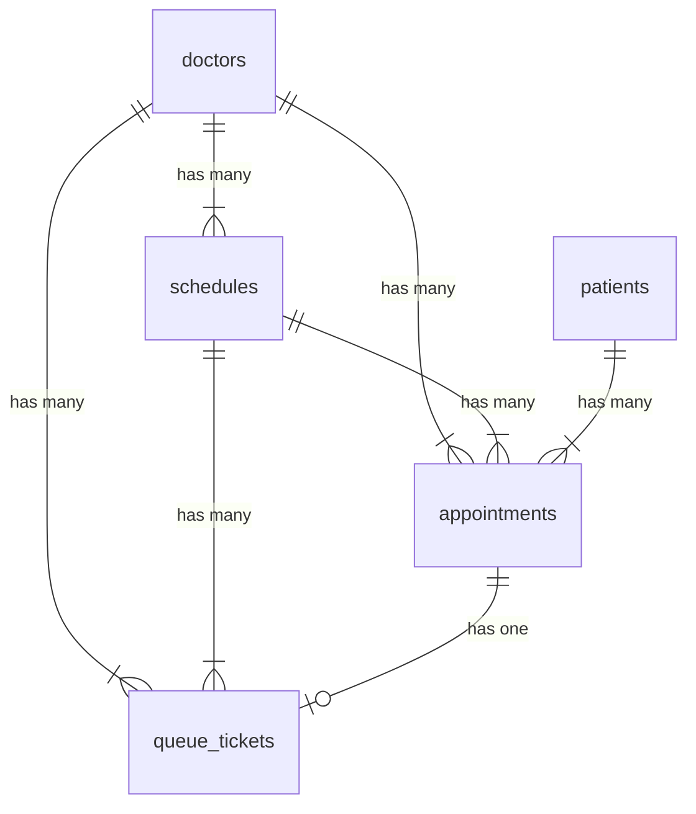

# Product Requirements Document (PRD)
## Sistem Informasi Layanan Klinik / Rumah Sakit

| | |
|--|--|
| **Nama Sistem** | Sistem Informasi Manajemen Jadwal & Antrian Dokter |
| **Tanggal** | 3 September 2026 |
| **Penyusun** | — |
| **Instansi** | Klinik / Rumah Sakit |

---

## Ringkasan Sistem

> *Sistem informasi terpadu untuk mengelola jadwal praktik dokter, pendaftaran janji temu pasien, proses check-in, dan antrian layanan di klinik/rumah sakit.*

Klinik/Rumah Sakit membutuhkan sistem digital terpadu untuk mengelola layanan **jadwal praktik dokter, pemesanan janji temu (appointment), check-in pasien, dan antrian layanan**. Sistem ini memudahkan pasien mendaftar janji temu secara online, membantu staf administrasi mengelola jadwal dokter dan antrian harian, serta memberikan pimpinan laporan kunjungan dan kinerja layanan secara real-time. Target: memangkas waktu proses pendaftaran dari **antrian manual di loket ±30 menit** menjadi **booking online < 2 menit dengan check-in otomatis**.

---

## Arsitektur & Teknologi

### Stack Teknologi

| Komponen | Teknologi | Versi | Keterangan |
|----------|-----------|-------|------------|
| **Bahasa** | PHP | ≥ 8.3 | Versi minimum yang didukung Laravel 13 |
| **Framework** | [Laravel](https://laravel.com/) | v13 | Full-stack PHP framework |
| **Admin Panel** | [Filament](https://filamentphp.com/) | v5 | UI framework berbasis TALL Stack (Tailwind CSS, Alpine.js, Livewire, Laravel) |
| **Database** | PostgreSQL | ≥ 16 | RDBMS utama untuk seluruh data aplikasi |
| **Frontend** | TALL Stack | — | Tailwind CSS + Alpine.js + Livewire (bawaan Filament) |

### Arsitektur Database — PostgreSQL

> *Gunakan PostgreSQL sebagai satu-satunya RDBMS. Manfaatkan fitur-fitur native PostgreSQL berikut sesuai kebutuhan:*

| Fitur PostgreSQL | Kegunaan dalam Sistem |
|------------------|-----------------------|
| **Auto-increment Integer** | Primary key standar (`id`) untuk seluruh tabel |
| **JSONB** | Menyimpan data dinamis/metadata fleksibel (contoh: detail keluhan pasien, catatan dokter) |
| **Full-Text Search** (`tsvector`) | Pencarian cepat pada data pasien, dokter, dan riwayat kunjungan |
| **Enum Types** | Status appointment (`pending`, `confirmed`, `checked_in`, `in_progress`, `completed`, `cancelled`, `no_show`) |
| **Partial Index** | Index kondisional untuk query jadwal hari ini dan antrian aktif |
| **Foreign Key Constraints** | Integritas referensial antar tabel (dokter → jadwal → appointment → antrian) |
| **Timestamp with Time Zone** | Konsistensi waktu lintas zona (penting untuk klinik multi-cabang) |

### Struktur Panel Filament v5

> *Filament v5 mendukung multi-panel. Definisikan panel sesuai peran pengguna.*

| Panel | Path | Peran Pengguna | Auth Model | Deskripsi |
|-------|------|----------------|------------|-----------|
| **Admin** | `/admin` | Administrator, Operator, Petugas Loket, Pimpinan | `User` | Kelola seluruh data: jadwal dokter, appointment, antrian, manajemen pengguna, dashboard & laporan |
| **Dokter** | `/dokter` | Dokter | `Doctor` | Lihat jadwal praktik sendiri, daftar pasien hari ini, update status konsultasi |

> **Interaksi Pasien** tidak menggunakan panel Filament, melainkan **halaman Livewire frontend** di path `/` (public) dan `/patient/*` (setelah login pasien).

### Komponen Filament v5 yang Digunakan

| Komponen | Fungsi |
|----------|--------|
| **Resources** | CRUD untuk setiap entitas utama (Doctor, Schedule, Appointment, Queue, Patient) |
| **Relation Managers** | Mengelola relasi (contoh: Schedules dalam Doctor, Appointments dalam Schedule, Queues dalam Appointment) |
| **Dashboard Widgets** | Stat widgets, chart widgets untuk metrik kunjungan dan antrian real-time |
| **Actions & Modals** | Konfirmasi aksi, form input dalam modal (contoh: confirm appointment, check-in pasien, panggil antrian) |
| **Notifications** | Notifikasi in-app untuk perubahan status appointment dan panggilan antrian |
| **Tables** | Tabel data dengan filter, sort, search, dan bulk actions |
| **Forms** | Form builder dengan validasi, conditional fields, dan file upload |
| **Infolists** | Tampilan detail read-only untuk riwayat pasien dan detail konsultasi |
| **Custom Pages** | Halaman khusus (contoh: display antrian publik, kalender jadwal dokter, self check-in kiosk) |

---

## 1. Pengguna Sistem

| Peran | Siapa | Yang Mereka Lakukan | Akses |
|-------|-------|---------------------|-------|
| **Administrator** | Staf TI Klinik/RS | Kelola seluruh data master, hak akses pengguna, konfigurasi sistem | Panel Admin |
| **Operator / Petugas Loket** | Staf administrasi / front desk | Input jadwal dokter, konfirmasi appointment, proses check-in manual, kelola antrian | Panel Admin |
| **Pimpinan** | Kepala Klinik / Direktur RS | Lihat dashboard kinerja, laporan kunjungan, statistik dokter — hanya baca | Panel Admin (role terbatas) |
| **Dokter** | Dokter spesialis / umum | Lihat jadwal praktik, daftar pasien, mulai/selesaikan konsultasi, tulis catatan medis | Panel Dokter |
| **Pasien** | Pasien individu | Daftar janji temu online, check-in mandiri, cek status antrian, lihat riwayat kunjungan | Livewire Frontend |

---

## 2. Layanan yang Dikelola Sistem

> *Untuk setiap layanan: jelaskan alurnya dan data apa yang perlu dicatat.*
> *Aturan bisnis penting wajib dituliskan — ini yang akan menjadi validasi di sistem.*

---

### Layanan 1 — Manajemen Jadwal Dokter (Doctor Schedule Management)

**Deskripsi:** Pengelolaan jadwal praktik dokter termasuk hari, jam mulai/selesai, kuota pasien per sesi, dan status ketersediaan. Operator dapat mengatur jadwal rutin (mingguan berulang) maupun jadwal khusus/libur.

**Alur:**
1. Administrator/Operator mendaftarkan data dokter beserta spesialisasi ke sistem
2. Operator membuat jadwal praktik dokter (hari, jam mulai, jam selesai, kuota pasien)
3. Jadwal dapat diatur berulang (recurring weekly) atau sebagai jadwal khusus (one-time)
4. Dokter/Operator dapat menonaktifkan jadwal tertentu jika dokter berhalangan (cuti, sakit, dll)
5. Jadwal yang aktif otomatis ditampilkan di portal pasien untuk booking

**Data yang dicatat:**

| Data | Tabel | Kolom | Tipe |
|------|-------|-------|------|
| Nama dokter | `doctors` | `name` | `string` |
| Nomor STR | `doctors` | `license_number` | `string, unique` |
| Email (login) | `doctors` | `email` | `string, unique` |
| Password | `doctors` | `password` | `string` |
| Email verified | `doctors` | `email_verified_at` | `timestampTz, nullable` |
| Remember token | `doctors` | `remember_token` | `string, nullable` |
| Telepon dokter | `doctors` | `phone` | `string, nullable` |
| Foto dokter | `doctors` | `photo` | `string, nullable` |
| Bio singkat | `doctors` | `bio` | `text, nullable` |
| Status aktif | `doctors` | `is_active` | `boolean, default true` |
| Spesialisasi | `doctors` | `specialty` | `string, nullable` |
| Hari praktik | `schedules` | `day_of_week` | `smallint (0=Minggu..6=Sabtu)` |
| Tanggal spesifik | `schedules` | `specific_date` | `date, nullable` |
| Jam mulai | `schedules` | `start_time` | `time` |
| Jam selesai | `schedules` | `end_time` | `time` |
| Kuota pasien | `schedules` | `max_patients` | `integer` |
| Status jadwal | `schedules` | `status` | `enum: active, inactive, cancelled` |
| Catatan jadwal | `schedules` | `notes` | `text, nullable` |
| Tipe jadwal | `schedules` | `type` | `enum: recurring, one_time` |
| Relasi dokter | `schedules` | `doctor_id` | `foreignId → doctors` |

**Aturan bisnis:**
- Jadwal dokter **tidak boleh overlap** — satu dokter tidak bisa punya dua jadwal di hari dan jam yang sama
- Kuota pasien per sesi minimal **1** dan maksimal **50** pasien
- Jika jadwal dibatalkan (`cancelled`), semua appointment terkait yang masih `pending`/`confirmed` otomatis dibatalkan dan pasien dikirim notifikasi
- Jadwal recurring otomatis generate slot mingguan; jadwal `one_time` hanya berlaku untuk `specific_date`
- Hanya jadwal berstatus `active` yang ditampilkan di portal pasien

**Model & Relasi Eloquent:**

| Model | Tabel | Relasi Utama |
|-------|-------|-------------|
| `Doctor` | `doctors` | `hasMany(Schedule)` |
| `Schedule` | `schedules` | `belongsTo(Doctor)`, `hasMany(Appointment)` |

---

### Layanan 2 — Janji Temu Dokter (Doctor Appointment)

**Deskripsi:** Pasien dapat membuat janji temu dengan dokter berdasarkan jadwal yang tersedia. Appointment bisa dibuat oleh pasien melalui portal atau oleh operator melalui panel admin. Setiap appointment memiliki status yang mengikuti alur bisnis.

**Alur:**
1. Pasien memilih spesialisasi/dokter yang diinginkan
2. Pasien memilih jadwal yang tersedia (tanggal & sesi) — sistem menampilkan sisa kuota
3. Pasien mengisi data pendaftaran (keluhan utama, jenis kunjungan: baru/kontrol)
4. Sistem men-generate kode booking unik dan mengirimkan konfirmasi
5. Operator dapat memverifikasi dan mengkonfirmasi appointment (opsional, tergantung konfigurasi)
6. Pasien menerima notifikasi konfirmasi beserta nomor booking
7. Jika pasien tidak datang, status diubah menjadi `no_show`

**Data yang dicatat:**

| Data | Tabel | Kolom | Tipe |
|------|-------|-------|------|
| Kode booking | `appointments` | `booking_code` | `string, unique` |
| Tanggal janji | `appointments` | `appointment_date` | `date` |
| Waktu mulai estimasi | `appointments` | `estimated_time` | `time, nullable` |
| Jenis kunjungan | `appointments` | `visit_type` | `enum: new_visit, follow_up` |
| Keluhan utama | `appointments` | `chief_complaint` | `text, nullable` |
| Catatan pasien | `appointments` | `patient_notes` | `text, nullable` |
| Status | `appointments` | `status` | `enum: pending, confirmed, checked_in, in_progress, completed, cancelled, no_show` |
| Sumber booking | `appointments` | `source` | `enum: online, walk_in, phone` |
| Alasan batal | `appointments` | `cancellation_reason` | `text, nullable` |
| Waktu dibatalkan | `appointments` | `cancelled_at` | `timestampTz, nullable` |
| Metadata tambahan | `appointments` | `metadata` | `jsonb, nullable` |
| Relasi pasien | `appointments` | `patient_id` | `foreignId → patients` |
| Relasi jadwal | `appointments` | `schedule_id` | `foreignId → schedules` |
| Relasi dokter | `appointments` | `doctor_id` | `foreignId → doctors` |
| Dibuat oleh | `appointments` | `created_by` | `integer, nullable (ID dari users/doctors)` |

**Data Pasien:**

| Data | Tabel | Kolom | Tipe |
|------|-------|-------|------|
| Nomor rekam medis | `patients` | `medical_record_number` | `string, unique` |
| Nama lengkap | `patients` | `name` | `string` |
| Email (login) | `patients` | `email` | `string, unique, nullable` |
| Password | `patients` | `password` | `string, nullable` |
| Email verified | `patients` | `email_verified_at` | `timestampTz, nullable` |
| Remember token | `patients` | `remember_token` | `string, nullable` |
| Tanggal lahir | `patients` | `date_of_birth` | `date` |
| Jenis kelamin | `patients` | `gender` | `enum: male, female` |
| NIK | `patients` | `national_id` | `string, unique, nullable` |
| Telepon | `patients` | `phone` | `string` |
| Alamat | `patients` | `address` | `text, nullable` |
| Golongan darah | `patients` | `blood_type` | `enum: A, B, AB, O, nullable` |
| Alergi | `patients` | `allergies` | `jsonb, nullable` |
| Foto | `patients` | `photo` | `string, nullable` |

**Aturan bisnis:**
- Satu pasien **tidak bisa membuat lebih dari 1 appointment aktif** (status `pending`/`confirmed`) di jadwal yang sama pada tanggal yang sama
- Appointment hanya bisa dibuat jika **kuota jadwal belum penuh** pada tanggal tersebut
- Kode booking di-generate otomatis dengan format `APT-YYYYMMDD-XXXX` (contoh: `APT-20260903-0012`)
- Pembatalan oleh pasien hanya bisa dilakukan minimal **H-1** sebelum tanggal janji
- Pembatalan oleh operator/admin bisa dilakukan kapan saja dengan wajib mengisi alasan
- Appointment yang tidak di-check-in hingga **30 menit** setelah jadwal berakhir otomatis berstatus `no_show`
- Pasien dengan riwayat **3x no_show** dalam 30 hari terakhir mendapat peringatan saat booking baru

**Model & Relasi Eloquent:**

| Model | Tabel | Relasi Utama |
|-------|-------|-------------|
| `Patient` | `patients` | `hasMany(Appointment)` |
| `Appointment` | `appointments` | `belongsTo(Patient)`, `belongsTo(Schedule)`, `belongsTo(Doctor)`, `hasOne(QueueTicket)` |

---

### Layanan 3 — Check-in Pasien (Patient Check-in)

**Deskripsi:** Proses check-in dilakukan setelah pasien tiba di klinik/rumah sakit. Check-in bisa dilakukan secara mandiri oleh pasien (self check-in via portal/kiosk) atau oleh petugas loket. Setelah check-in berhasil, pasien otomatis masuk ke antrian layanan.

**Alur:**
1. Pasien tiba di klinik dan melakukan check-in (scan QR kode booking / input kode booking / petugas loket)
2. Sistem memvalidasi appointment: status harus `confirmed`, tanggal sesuai hari ini, jadwal dokter aktif
3. Status appointment berubah dari `confirmed` → `checked_in`
4. Sistem otomatis membuat tiket antrian (`QueueTicket`) dan meng-assign nomor urut
5. Pasien menerima nomor antrian dan estimasi waktu tunggu
6. Nomor antrian ditampilkan di display antrian publik

**Data yang dicatat:**

| Data | Tabel | Kolom | Tipe |
|------|-------|-------|------|
| Waktu check-in | `appointments` | `checked_in_at` | `timestampTz, nullable` |
| Metode check-in | `appointments` | `check_in_method` | `enum: self_service, counter, qr_scan, nullable` |
| Petugas check-in | `appointments` | `checked_in_by` | `integer, nullable (ID dari users)` |

**Aturan bisnis:**
- Check-in hanya bisa dilakukan pada **hari H** appointment (tidak bisa H-1 atau H+1)
- Check-in hanya bisa dilakukan jika status appointment = `confirmed`
- Check-in dibuka **maksimal 60 menit sebelum** jam mulai jadwal dan ditutup **30 menit setelah** jam selesai jadwal
- Setelah check-in, sistem otomatis membuat `QueueTicket` dengan nomor urut berdasarkan waktu check-in
- Walk-in patient (tanpa appointment) bisa di-check-in oleh petugas loket — sistem otomatis membuat appointment berstatus `checked_in` + tiket antrian

**Model & Relasi Eloquent:**

> Check-in merupakan perubahan status pada model `Appointment` yang sudah ada. Tidak perlu model terpisah. Logika check-in diimplementasikan sebagai **Action class** (`CheckInPatientAction`).

---

### Layanan 4 — Antrian Layanan (Service Queue)

**Deskripsi:** Sistem antrian digital yang mengelola urutan pasien untuk dilayani dokter. Setelah check-in, pasien mendapat nomor antrian dan dapat melihat posisi serta estimasi waktu tunggu secara real-time. Dokter/operator memanggil pasien berdasarkan urutan antrian.

**Alur:**
1. Setelah check-in, sistem membuat tiket antrian dengan nomor urut
2. Pasien menunggu di ruang tunggu dan memantau nomor antrian di display/portal
3. Dokter/Operator memanggil pasien berikutnya (next in queue) — status tiket: `serving`
4. Status appointment berubah menjadi `in_progress`
5. Setelah konsultasi selesai, dokter menandai selesai — status tiket: `completed`
6. Status appointment berubah menjadi `completed`
7. Jika pasien tidak merespons panggilan (3x panggilan), status tiket: `skipped`
8. Pasien yang di-skip bisa di-recall (dipanggil ulang) oleh operator

**Data yang dicatat:**

| Data | Tabel | Kolom | Tipe |
|------|-------|-------|------|
| Nomor antrian | `queue_tickets` | `queue_number` | `integer` |
| Prefix antrian | `queue_tickets` | `prefix` | `string (contoh: A, B, C)` |
| Nomor display | `queue_tickets` | `display_number` | `string (contoh: A-001)` |
| Status tiket | `queue_tickets` | `status` | `enum: waiting, serving, completed, skipped, cancelled` |
| Waktu dipanggil | `queue_tickets` | `called_at` | `timestampTz, nullable` |
| Waktu mulai dilayani | `queue_tickets` | `served_at` | `timestampTz, nullable` |
| Waktu selesai | `queue_tickets` | `completed_at` | `timestampTz, nullable` |
| Jumlah panggilan | `queue_tickets` | `call_count` | `integer, default 0` |
| Ruangan/counter | `queue_tickets` | `counter` | `string, nullable` |
| Catatan | `queue_tickets` | `notes` | `text, nullable` |
| Prioritas | `queue_tickets` | `priority` | `enum: normal, priority, emergency` |
| Relasi appointment | `queue_tickets` | `appointment_id` | `foreignId → appointments` |
| Relasi dokter | `queue_tickets` | `doctor_id` | `foreignId → doctors` |
| Relasi jadwal | `queue_tickets` | `schedule_id` | `foreignId → schedules` |
| Tanggal antrian | `queue_tickets` | `queue_date` | `date` |

**Tabel Counter/Ruangan (Opsional):**

| Data | Tabel | Kolom | Tipe |
|------|-------|-------|------|
| Nama ruangan | `service_counters` | `name` | `string` |
| Kode ruangan | `service_counters` | `code` | `string, unique` |
| Lokasi/lantai | `service_counters` | `location` | `string, nullable` |
| Status | `service_counters` | `is_active` | `boolean, default true` |

**Aturan bisnis:**
- Nomor antrian di-reset setiap hari (mulai dari 1) per dokter/per jadwal
- Format nomor display: `{Prefix}-{NomorUrut 3 digit}` contoh `A-001`, `B-015`
- Prefix ditentukan berdasarkan dokter atau jadwal
- Antrian **hanya berlaku untuk hari itu** — tiket yang tidak selesai di akhir hari otomatis `cancelled`
- Pasien yang di-skip bisa di-**recall** maksimal **2 kali** — setelah itu otomatis `cancelled`
- Pasien dengan prioritas `priority` (lansia, disabilitas, ibu hamil) ditempatkan di urutan lebih awal
- Pasien `emergency` langsung dipanggil (masuk urutan pertama)
- Estimasi waktu tunggu dihitung berdasarkan rata-rata waktu layanan per dokter

**Model & Relasi Eloquent:**

| Model | Tabel | Relasi Utama |
|-------|-------|-------------|
| `QueueTicket` | `queue_tickets` | `belongsTo(Appointment)`, `belongsTo(Doctor)`, `belongsTo(Schedule)` |
| `ServiceCounter` | `service_counters` | — (opsional, bisa di-hardcode jika sedikit) |

---

## Ringkasan Seluruh Model & Tabel

| # | Model | Tabel | PK | Auth | Deskripsi |
|---|-------|-------|----|----- |-----------|
| 1 | `User` | `users` | `id` (integer, auto-increment) | ✅ Panel Admin (Filament) | Admin, Operator, Pimpinan — bawaan Laravel |
| 2 | `Doctor` | `doctors` | `id` (integer, auto-increment) | ✅ Panel Dokter (Filament) | Data profil & login dokter (implements `Authenticatable`) |
| 3 | `Schedule` | `schedules` | `id` (integer, auto-increment) | — | Jadwal praktik dokter |
| 4 | `Patient` | `patients` | `id` (integer, auto-increment) | ✅ Livewire Frontend | Data pasien & login frontend (implements `Authenticatable`) |
| 5 | `Appointment` | `appointments` | `id` (integer, auto-increment) | — | Janji temu / pendaftaran pasien |
| 6 | `QueueTicket` | `queue_tickets` | `id` (integer, auto-increment) | — | Tiket antrian layanan harian |
| 7 | `ServiceCounter` | `service_counters` | `id` (integer, auto-increment) | — | Master ruangan/counter layanan (opsional) |

### Diagram Relasi (ERD)

---

## 3. Laporan & Dashboard yang Dibutuhkan

### Dashboard Admin (tampil saat login di panel Admin)

| Informasi | Keterangan |
|-----------|------------|
| Total appointment hari ini | Jumlah janji temu terdaftar untuk hari berjalan per status |
| Antrian aktif sekarang | Jumlah pasien yang sedang menunggu (status `waiting`) per dokter |
| Pasien sudah dilayani hari ini | Total pasien dengan status `completed` hari ini |
| No-show hari ini | Jumlah pasien yang tidak datang |
| Rata-rata waktu tunggu | Rata-rata selisih `called_at - checked_in_at` dalam menit |
| Rata-rata durasi konsultasi | Rata-rata selisih `completed_at - served_at` dalam menit |
| Dokter aktif hari ini | Jumlah dokter yang memiliki jadwal aktif hari ini |
| Appointment minggu ini | Grafik tren appointment 7 hari terakhir |
| Total kunjungan bulan ini | Jumlah total kunjungan pasien bulan berjalan |
| Perbandingan bulanan | Perbandingan kunjungan bulan ini vs bulan lalu (% naik/turun) |
| Dokter paling banyak kunjungan | Ranking dokter berdasarkan jumlah pasien |
| Tingkat no-show | Persentase no-show dari total appointment |
| Tren kunjungan tahunan | Grafik line chart kunjungan 12 bulan terakhir |

### Dashboard Dokter (tampil saat login di panel Dokter)

| Informasi | Keterangan |
|-----------|------------|
| Pasien hari ini | Daftar appointment hari ini untuk dokter tersebut |
| Antrian saat ini | Nomor antrian yang sedang dilayani & yang menunggu |
| Total pasien bulan ini | Jumlah pasien yang sudah dikonsultasi bulan berjalan |
| Statistik kunjungan | Grafik tren kunjungan 30 hari terakhir |

### Laporan Berkala

| Laporan | Frekuensi | Isi | Format |
|---------|-----------|-----|--------|
| Rekap Kunjungan Harian | Harian | Total pasien per dokter, per spesialisasi, per status | Excel & PDF |
| Statistik Kunjungan Bulanan | Bulanan | Jumlah per spesialisasi, per dokter, rasio new vs follow-up | PDF |
| Laporan Kinerja Dokter | Bulanan | Jumlah pasien, rata-rata durasi konsultasi, tingkat no-show per dokter | Excel & PDF |
| Laporan Antrian & Waktu Tunggu | Mingguan | Rata-rata waktu tunggu per hari, per jadwal, per dokter | Excel |
| Laporan Tren Kunjungan | Triwulanan | Analisis tren naik/turun, spesialisasi tumbuh, jam sibuk | PDF |

---

## 4. Custom Pages & Fitur Khusus

### Halaman Filament (Panel Admin & Dokter)

| Halaman / Fitur | Panel | Deskripsi |
|-----------------|-------|-----------|
| **Kalender Jadwal Dokter** | Admin | Tampilan kalender interaktif ketersediaan jadwal dokter per hari |
| **Cetak Nomor Antrian** | Admin | Cetak tiket antrian (thermal printer) dengan nomor urut, nama dokter, estimasi waktu |
| **Riwayat Kunjungan Pasien** | Dokter | Timeline riwayat kunjungan pasien lengkap dengan tanggal, dokter, dan catatan |

### Halaman Livewire Frontend (Pasien & Publik)

| Halaman | Route | Auth | Deskripsi |
|---------|-------|------|-----------|
| **Beranda** | `/` | Public | Landing page klinik, daftar dokter & spesialisasi, CTA booking |
| **Cari Dokter & Jadwal** | `/doctors` | Public | Daftar dokter, filter spesialisasi, lihat jadwal tersedia |
| **Booking Appointment** | `/booking/{schedule}` | Patient (login) | Form janji temu: pilih tanggal, isi keluhan, konfirmasi |
| **Login Pasien** | `/patient/login` | Guest | Halaman login pasien |
| **Register Pasien** | `/patient/register` | Guest | Halaman registrasi pasien baru |
| **Dashboard Pasien** | `/patient/dashboard` | Patient | Ringkasan: appointment aktif, nomor antrian, riwayat |
| **Riwayat Kunjungan** | `/patient/appointments` | Patient | Daftar semua appointment & riwayat kunjungan |
| **Self Check-in** | `/patient/check-in` | Patient | Input kode booking / scan QR → check-in otomatis |
| **Status Antrian** | `/patient/queue` | Patient | Lihat posisi antrian & estimasi waktu tunggu real-time |
| **Display Antrian Publik** | `/queue-display` | Public | Layar TV/monitor ruang tunggu — nomor antrian real-time (auto-refresh / Livewire polling) |
| **Self Check-in Kiosk** | `/kiosk` | Public | Halaman full-screen mesin kiosk: input kode booking → check-in → cetak antrian |

---

> **Catatan untuk AI Coding Assistant:**
>
> **Stack & Arsitektur:**
> - Framework: **Laravel 13** dengan **Filament v5** (TALL Stack)
> - Database: **PostgreSQL ≥ 16** — gunakan migration Laravel dengan driver `pgsql`
> - Gunakan **2 auth guard** untuk Filament: `web` (User → Panel Admin), `doctor` (Doctor → Panel Dokter)
> - Gunakan **1 auth guard tambahan** untuk Livewire frontend: `patient` (Patient → halaman pasien)
> - Filament hanya dipakai untuk **2 panel** (Admin & Dokter); interaksi pasien via **Livewire full-page components**
> - Gunakan **integer auto-increment** (`$table->id()`) sebagai primary key untuk seluruh tabel
> - Gunakan **foreignId** (`$table->foreignId('xxx_id')`) untuk seluruh foreign key
> - Gunakan fitur **JSONB** PostgreSQL untuk metadata dinamis via Laravel `$casts`
> - Gunakan **Enum type** PostgreSQL untuk kolom status (atau string enum yang dicasting di Model)
>
> **Mapping PRD → Kode:**
> - **Layanan 1 (Jadwal Dokter)** → Filament Resources: `DoctorResource`, `ScheduleResource` + migrations untuk `doctors`, `schedules`
> - **Layanan 2 (Janji Temu)** → Filament Resources: `AppointmentResource`, `PatientResource` + migrations untuk `appointments`, `patients`
> - **Layanan 3 (Check-in)** → Action class `CheckInPatientAction` + tambahan kolom `checked_in_at`, `check_in_method`, `checked_in_by` di tabel `appointments`
> - **Layanan 4 (Antrian)** → Filament Resource: `QueueTicketResource` + Custom Page `QueueDisplayPage` + migration untuk `queue_tickets`, `service_counters`
> - Setiap **alur** → urutan status pada kolom `status` (enum) di tabel terkait
> - Setiap **data yang dicatat** → kolom-kolom pada migration + `$fillable` di Eloquent Model
> - Setiap **aturan bisnis** → validasi di Form schema Filament + business logic di Model/Action class
> - Setiap **peran pengguna admin/dokter** → Panel Filament terpisah dengan middleware auth + policy authorization
> - **Interaksi pasien** → Livewire full-page components dengan guard `patient`, routes di `routes/web.php`
> - Bagian 3 (Laporan) → `StatsOverviewWidget`, `ChartWidget` di dashboard Filament + fitur ekspor PDF/Excel
>
> **Penamaan Laravel Standard:**
> - Model: PascalCase singular (`Doctor`, `Schedule`, `Appointment`, `Patient`, `QueueTicket`, `ServiceCounter`)
> - Tabel: snake_case plural (`doctors`, `schedules`, `appointments`, `patients`, `queue_tickets`, `service_counters`)
> - Foreign key: `{model_snake}_id` (`doctor_id`, `schedule_id`, `patient_id`, `appointment_id`)
>
> **Referensi:**
> - Dokumentasi Filament v5: https://filamentphp.com/docs
> - Dokumentasi Laravel: https://laravel.com/docs
> - Dokumentasi PostgreSQL: https://www.postgresql.org/docs/

---
